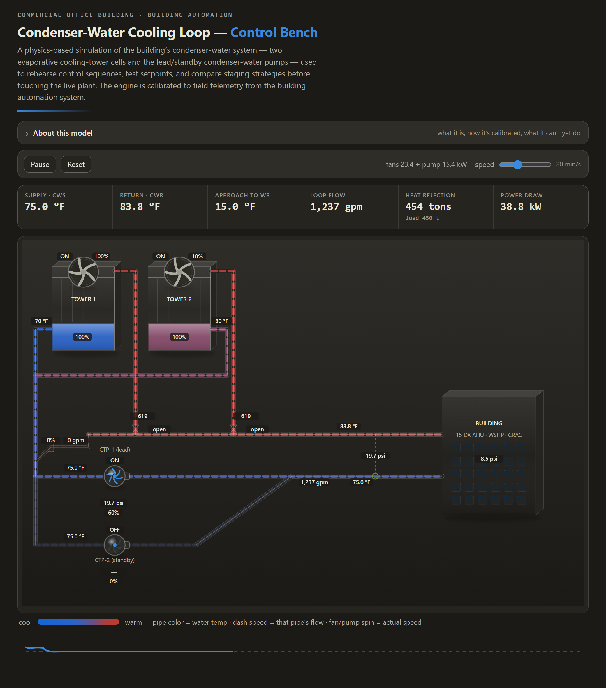

# Condenser-Water Loop — Control Bench

A physics-based, browser-based simulator of a commercial building's condenser-water cooling loop — two evaporative cooling-tower cells and lead/standby condenser-water pumps. One self-contained HTML file: no build, no dependencies, no backend.

It's a **control and efficiency test bench**, not a data historian — a place to rehearse the cooling-tower sequence of operations, try setpoints, compare pump/fan staging, and see the energy cost, against a model calibrated to real plant telemetry. Open `index.html` and it runs.

## What it does

- **Live animated schematic** — pipe color tracks water temperature, dash speed tracks flow, fans and pumps spin at their modeled speed, with live values at each sensor and valve.
- **The sequence runs the plant** — tower staging, CWS low-limit protection, freeze logic, and economizer gating operate automatically; or take any actuator to **HAND** to override the sequence (including its safeties) and drive the plant into failure modes on purpose.
- **KPI faceplate** — supply / return temperature, approach to wet-bulb, loop flow, heat rejection, and live electrical power draw (fans + pump).
- **Everything adjustable, live** — setpoints, sequencing thresholds, tower and hydraulic constants, PID gains, ambient (OAT / wet-bulb), and a weather-driven building-load model.
- **Optional live weather** — pick any US METAR/ICAO station (e.g. `KJFK`) or a global `lat,lon` pair, and the sim drives OAT + wet-bulb from real observations (NWS, with an Open-Meteo fallback). It's the only network call; everything else runs locally.
- **Alarm flags** — cavitation, low flow, low / freeze CWS, freeze risk, OAT lockout, over-HP, air ingestion, basin overflow, pump deadhead, basin low, and ΔT clamp.

## The model

- **Pumps** — affinity laws on a manufacturer head curve with a part-load efficiency curve; series / parallel hydraulic resistances are solved against the curve to find the operating flow.
- **Cooling tower** — an open evaporative tower in effectiveness (ε-NTU) / air-side Merkel form on the wet-bulb enthalpy driving force; airflow follows fan affinity, with a natural-draft floor when the fan is off.
- **Thermal transport** — first-order lags on the hot and cold legs, pinned to the measured loop transients.
- **Building load** — economizer-gated: a 24/7 IT/CRAC floor, an occupancy-scheduled AHU load, and bidirectional water-source heat pumps that add to or pull heat from the loop.

The hydraulic resistances, pump differential-pressure curve, transport volumes, and tower air-side cap are fit to building-automation (BAS) field trends; the equipment skeleton — tonnage, pump horsepower, pipe sizes, basin volume — is the real installed plant.

## Accuracy & limitations

It's a model, best used for **relative** comparisons (this staging vs. that one, this setpoint vs. that one) and for rehearsing sequences. In summer, fed true wet-bulb, steady-state supply temperature tracks the field to about **0.94 °F RMS** across the load range. Known limits:

- **Cold-weather behavior is unvalidated** — there's no sub-freezing field data yet, so the winter freeze / bypass physics and fan-speed sensitivity are provisional.
- **Loop load is treated as equal to tower heat rejection** — the compressor heat-of-rejection uplift (~×1.2) isn't applied yet, so duty reads slightly conservative.
- **Differential pressure is modeled as a function of flow** — correct for this constant-flow building, but it can't reproduce a measured DP-reset schedule.
- **The building-load model is a warm-season fit** — winter / heating-season loop load is modeled, not measured.
- **Quasi-steady thermal response** — steady-state behavior is the trustworthy part; transient accuracy isn't characterized.

## How to use it

- **Run it** — open `index.html` in any modern browser. To serve it live, use GitHub Pages (Settings → Pages → deploy from branch, root folder).
- **Drive it** — press **Pause/Run** to let the sequence operate the plant, or take an actuator to **HAND** to override it. Watch the faceplate and the **power draw** figure to weigh the energy cost of staging and setpoint choices.
- **Adapt it to another plant** — the model is generic in form and specific in numbers. Every site constant lives in the `CFG` object (plus a few nearby equipment constants) near the top of the `<script>` block, with inline notes on what each one is. Re-fit the hydraulics from a couple of pump-speed points and the tower from a fan / wet-bulb sweep. The SVG schematic is hand-laid for a two-cell layout, so a different plant topology means editing the SVG and its render bindings, not just the numbers.

## Stack

Vanilla HTML / CSS / JavaScript — no frameworks, no build, no dependencies. A single file you can read top to bottom.

## License

MIT — see [LICENSE](LICENSE).

## Disclaimer

An engineering and teaching tool. All outputs are model estimates and carry the limitations above; verify independently before acting on a real plant.
